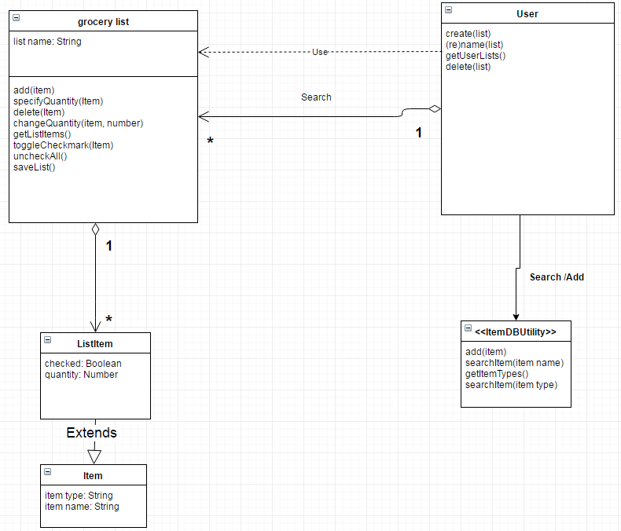
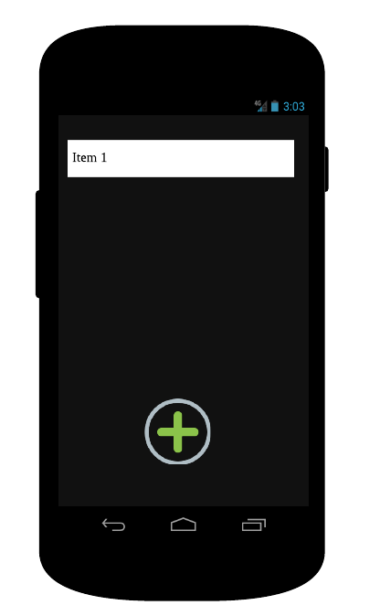
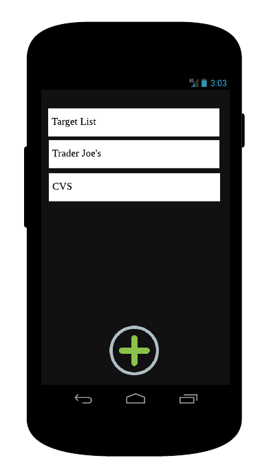
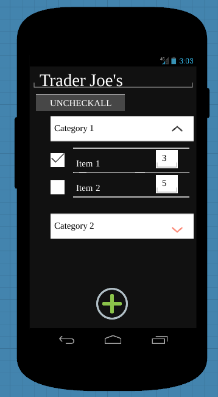
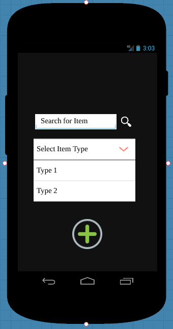

#### Version 1.1
# Design Document

## 1 Design Considerations

### 1.1 Assumptions

* The app will be run on an Android phone or tablet, with minimum SDK version 19.

* The user has a basic familiarity with Android devices, and is capable of starting the app, typing, and manipulating the UI via touch.

* The app is given access to a generic database of Items, along with their corresponding Types.

* The device has enough memory to support the Items Database, along with any necessary persistence data (ie. Grocery Lists).

### 1.2 Constraints

* Technical Constraints:

    + The programming language to be used is Java, as present in Android SDK version 19 and above.

    + The app may be paused, turned off, or restarted during its use.

* Business Constraints:

    + Must have an operating product by the end of Week 3 of the project.

    + No budget allocation for project: Any library used must be Free and Open-Source Software.

### 1.3 System Environment

* The system must operate on a phone or tablet running an Android minimum SDK version 19.

## 2 Architectural Design

### 2.1 Component Diagram

### 2.2 Deployment Diagram

## 3 Low-Level Design

### 3.1 Class Diagram 

### 3.2 Database relational mapping table

* In the application, we will use SQLite to create a database to store and manage the list and item information of the grocery list manager application. There would totally be three tables, one for item, one for list, and one for list item (store information of items in a list). The three table schema is as below:

#### TABLE_LISTS

| list_id | list_name |
|---------|----------|
|  1   |   list 1 |
|  2   |   list 2 |
|  3   |   list 3 |

#### TABLE_ITEMS

| item_id | item_name | item_type |
|---------|----------|----------|
|  1   |   item 1 | type 1 |
|  2   |   item 2 | type 2 |
|  3   |   item 3 | type 3 |

#### TABLE_LISTITEMS

| listIiem_id | list_id | item_id | item_quantity| item_checked |
|---------|----------|----------|---------|---------|
|  1   |   list_id 1 | item_id 1 | 5 | 1 |
|  2   |   list_id 2 | item_id 2 | 3.2 | 0 |
|  3   |   list_id 3 | item_id 3 | 9 | 1 |

## 4 User Interface Design

### 4.1

* The initial state of the app, where the user can create a new grocery list.

### 4.2

* As the user adds grocery lists, the lists appear in the view.

### 4.3

* The user can view the content of each grocery list, and add, remove, or change the quantity of items. When the user expands a category/type, all items of that type in the list will become visible. The user can also check/uncheck an item in the list, and there is also an option for the user to uncheck all items in a click. 

### 4.4

* The user has the ability to search for specific items by name, and add the item to the list. If the searched item is not in the database, the user has the ability to add the item to the database.
