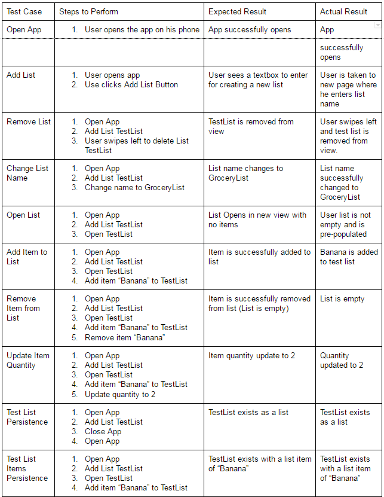
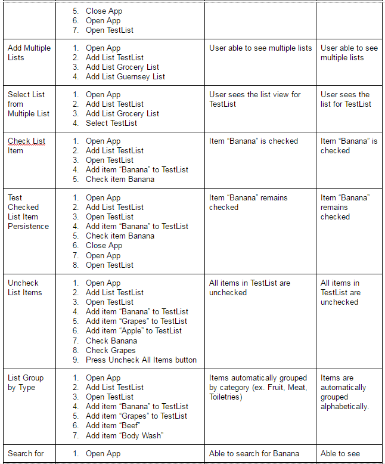
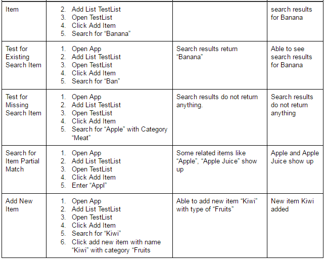

### Version: 1.1
# Test Plan

### Author: Team 81

## 1 Testing Strategy

### 1.1 Overall strategy

The overall testing strategy will involve manual testing against the test cases. There will also be white box testing in the form of code reviews done by other team members to ensure correct implementation and that code adheres to proper style. Finally, the team will extensively user-test the app functionality.

### 1.2 Test Selection

We are going to use both white-box techniques through code review as well as black box testing by using unit testing through JUnit. After initial version of app is completed, the group will do integration testing of app functionality and also system testing for the application.

### 1.3 Adequacy Criterion

 All code will then undergo white box testing by review from another group member. All lines of code will be examined. Then, integration testing will be performed according to the test plan to ensure all functionality is working correctly. Finally, the group will extensively user-test the application and put it through a form of alpha testing. All resulting defects will be fixed.

### 1.4 Bug Tracking

Bugs and enhancement requests will be updated in the latest readme file for the app.

### 1.5 Technology

We will be using manual testing to test the app functionality.

## 2 Test Cases

Please see the below long table for all possible test cases.

